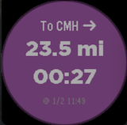

# NB.ai Navigation for Pebble



This Pebble watchapp provides real-time travel time and distance information from your current location to your selected destination. It uses the [NextBillion.ai Navigation API](https://docs.nextbillion.ai/routing/navigation-api) to fetch live routing data.

## Features

- **Real-time Updates**: Automatically refreshes travel data every 60 seconds.
- **Distance Display**: Shows the travel distance in miles.
- **Travel Time**: Displays the estimated duration in HH:MM format.
- **Status Timestamp**: Shows the exact time of the last successful data retrieval.
- **Custom UI**: Includes a custom vector navigation icon and a rebranded interface using NextBillion.ai colors.
- **Multi-Platform Support**: Compatible with Pebble Aplite (B&W), Basalt (Color), and Chalk (Round) watches.

## Configuration

To use this app, you must provide a valid NextBillion.ai API key.

1.  Open `src/js/pebble-js-app.js`.
2.  Locate the `myAPIKey` variable at the top of the file:
    ```javascript
    var myAPIKey = 'YOUR_NEXTBILLION_API_KEY_HERE';
    ```
3.  Replace the placeholder with your actual API key.

## How it Works

- The **JavaScript component** (`src/js/pebble-js-app.js`) handles the communication with the NextBillion.ai API.
- The **C component** (`src/navigation.c`) manages the watch's UI layers, including the custom-drawn navigation arrow and high-visibility text layers for distance and duration.
- Data is synchronized between the phone and the watch using the Pebble `AppSync` framework.

## Credits

Developed using [NextBillion.ai](https://nextbillion.ai/) Navigation services.
Original boilerplate provided by the Pebble SDK examples.
